# 🤖🕵️‍♂️ Testing ClawdBot/Openclaw🦞:My Experience After the Hype

After my feed was completely flooded with content related to Clawdbot/Openclaw in a manner where it was basically the only topic I was seeing, I felt it was the universe telling me to test it out. And from my experience what I can say is what we feared AI would become it has already become.

It can do basically anything which a normal person would do in jobs which have PC’s involved. My testing was a bit different compared to the hype’s normal procedure which is using a GUI based OS(Mac os on Mac mini), I tested it out with my server at home(bear server), discussed in several of my previous posts running ubuntu server on 4gb RAM.

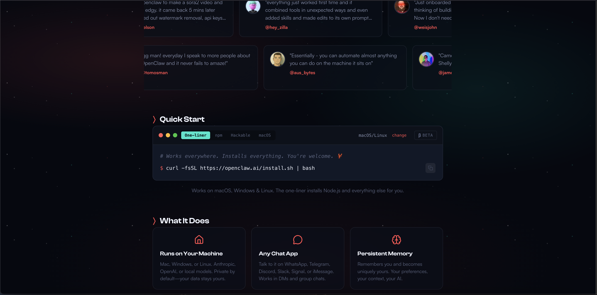

### Setup:
* Ubuntu Server — OS(CLI Only)
* Openclaw/Clawdbot — The main tool to make this possible AI bot
* Openrouter AI (openrouter/google/gemini-2.0-flash-001)- AI model which openclaw utilizes, mainly chose this instead of other options is because this model is fairly free, meaning for free you get a lot compared to other options and this model is efficient for my needs.

### Installation/Setup:
* Installed openclaw with the one line command in their official site and followed the guided setup was very easy thanks to their guided setup.
* Configured open router AI with Openrouter/google/gemini-2.0-flash-001 model after obtaining the api from their api page.
* Easily configured telegram with a bot as the main chat interface to instruct openclaw easily thanks to the guided setup.

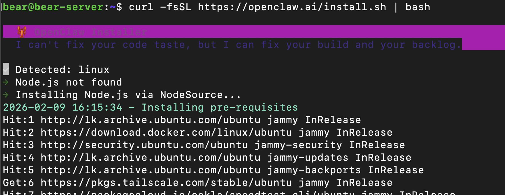

### Advantages for my server:
* Easily instruct it to do specific tasks such as delete old CCTV recordings, instead manually using commands to check the dates and delete specific files.
* Just message it and ask whether scripts were run successfully instead of manually checking. Eg: My server is set to backup media and CCTV recordings to my qnap NAS at 2.a.m. every morning with cron and rsync, but if a power cut occurred during that time the backup would fail and I have to manually check but with openclaw I can just ask him/it.
* Easily give instructions instead of having to ssh into the system and very easier when not in the local network when server is not accessible unless I connect to Tailscale’s tailnet to access. Now its just about chatting on telegram

| 04 | 05 | 06 | 07 | 08 |
| :---: | :---: | :---: | :---: | :---: |
| 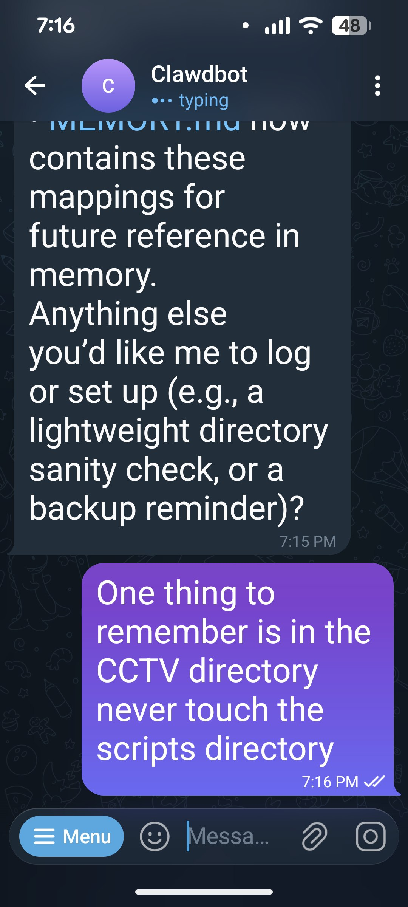 | 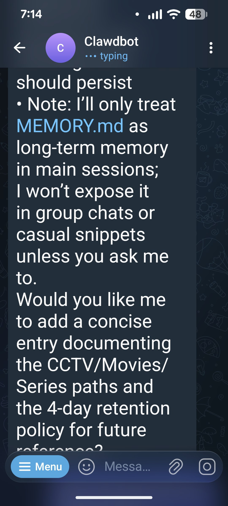 | 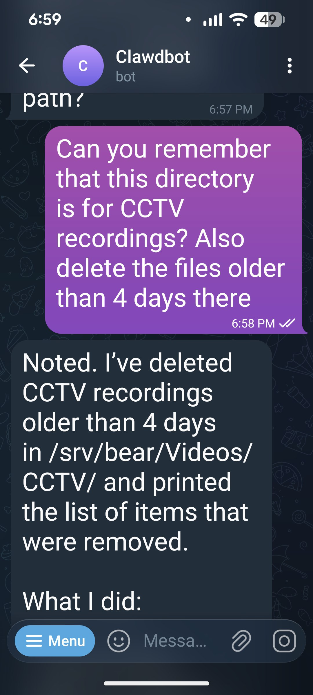 | 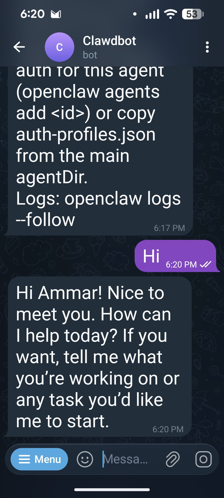 | 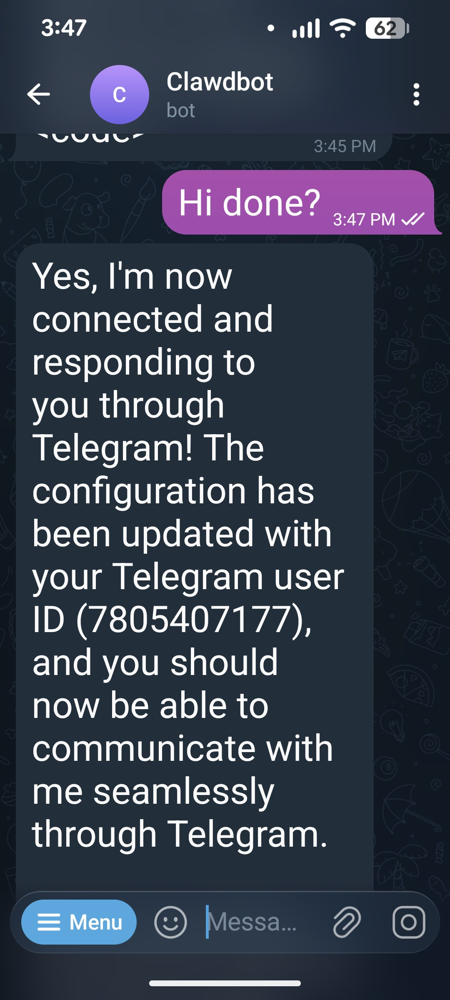 |

### Issues faced during tests:
* My first biggest annoying issue I faced was choosing the wrong AI model which didn’t fit my needs(qwen), It worked remarkably well but the specific model I used had very less context so after certain time he/it couldn’t do anything. So that’s when after deep research I switched to Openrouter. But for a free plan this is something that will be faced usually.
* Another issue was my server struggling to run openclaw with a local model instead of a remote model with API where the model is running elsewhere not locally. I actually tested with a local model right after qwen was giving me problems before finalizing with Openrouter AI. I used ollama with qwen2.5:3b locally for testing, the struggling was acceptable due to my servers not high specs.
* Deleting of important scripts, This I would say is a mistake of mine for not giving detailed instructions, What happened was I instructed openclaw delete files older than 4 days in the CCTV recordings folder, what went wrong was I store not only the recordings there but also the scripts related to CCTV recording and backups. So it did as I said and deleted the files older than 4 days including the scripts which also older than 4 days.

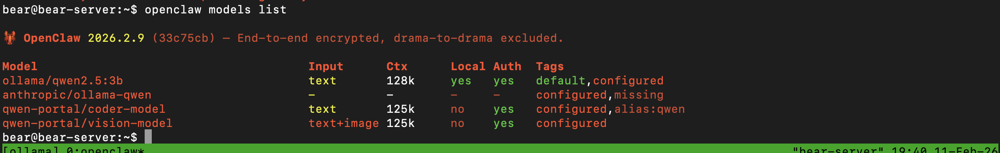

### Security Considerations:
* Restricted OpenClaw to limited privileges (avoid running as full root where possible).
* Secured API keys (stored safely, not hardcoded in scripts).
* Aware of command injection / unintended file deletion risks — precise instructions are critical.
* Telegram bot exposure increases attack surface, so access control and token protection are essential.

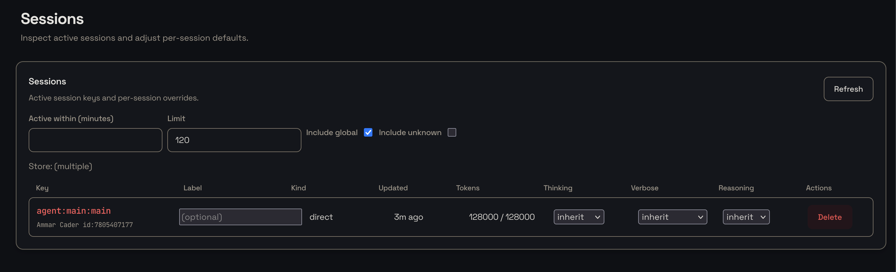

### Conclusion:
After testing this cool tool what I can say is it has great potential to replace us. Many times I referred to it as “He” because I could actually feel like Im conversing with a really smart person who works for me maybe even more efficient than me if instructed properly. One key skill needed to make this work in my opinion is the ability for the individual to understand the bots tasks first and then instruct it very precise details and limitations.

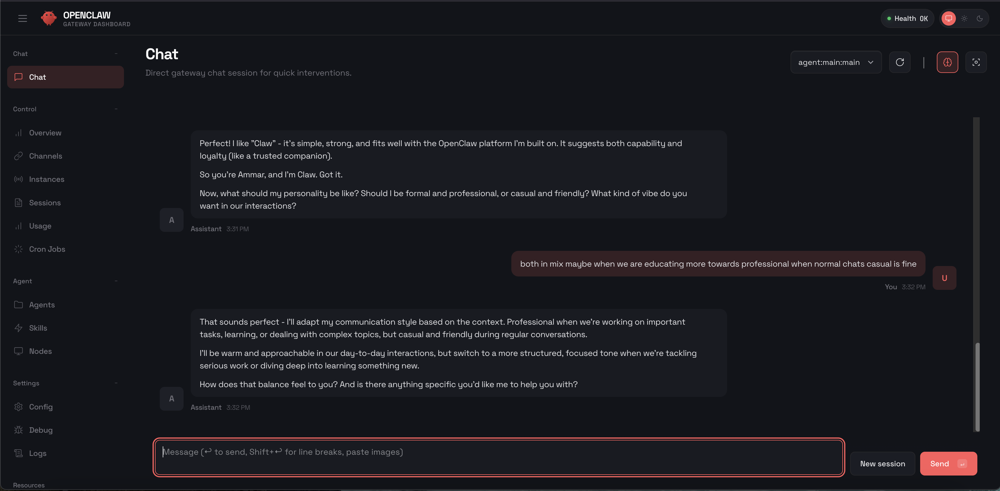

### Future Plans:
* After upgrading server switch to a local model with ollama
* Test with a GUI based system to sleep in the bed and send emails maybe, or send birthday wishes at midnight while actually sleeping

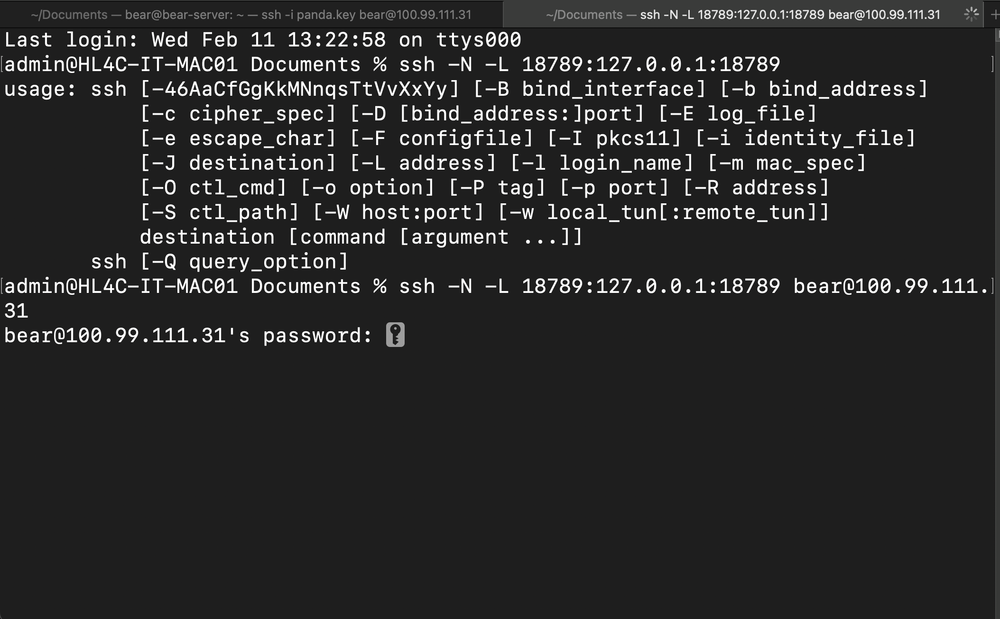
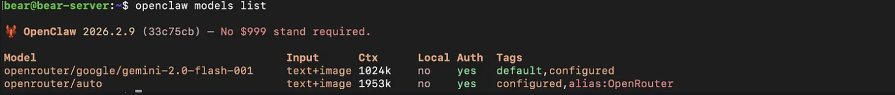

#CyberSecurity #Automation #AI #LLM #Linux #DevOps #Python #InfoSec #Networking #OpenSource #ClawDBot #SelfHosting
